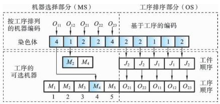
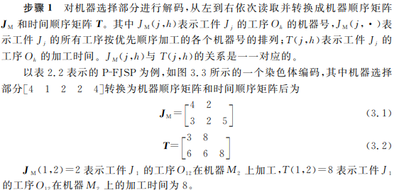

# 基于遗传算法的柔性车间生产调度问题

本项目主要涉及使用遗传算法解决柔性车间生产调度问题。

## 1. 根据实际问题创建 Instance.py

例如，以下是每一工件的生产加工时间表。


|      | 机器1 | 机器2 | 机器3 | 机器4 | 机器5 | 机器6 | 机器7 | 机器8 | 机器9 | 机器10 | 机器11 |
| :---: | :---: | :---: | :---: | :---: | :---: | :---: | :---: | :---: | :---: | :----: | :----: |
| 工序1 |  10  |   0   |   0   |   0   |   0   |   0   |   0   |   0   |   0   |   0   |   0   |
| 工序2 |   0   |   9   |   0   |   0   |   0   |   0   |   0   |   0   |   0   |   0   |   0   |
| 工序3 |   0   |   0   |  14  |  16  |   0   |   0   |   0   |   0   |   0   |   0   |   0   |
| 工序4 |   0   |   0   |   0   |   0   |  15  |  25  |  21  |   0   |   0   |   0   |   0   |
| 工序5 |   0   |   0   |   0   |   0   |   0   |   0   |   0   |   9   |  13  |   25   |   14   |

假设某一车间共生产 **5** 个上述的工件，对应的 **Instance.py** 应该写成下面的格式。

```python
Processing_time = [[10, 9999, 9999, 9999, 9999, 9999, 9999, 9999, 9999, 9999, 9999],
                   [9999, 9, 9999, 9999, 9999, 9999, 9999, 9999, 9999, 9999, 9999],
                   [9999, 9999, 14, 16, 9999, 9999, 9999, 9999, 9999, 9999, 9999],
                   [9999, 9999, 9999, 9999, 15, 25, 21, 9999, 9999, 9999, 9999],
                   [9999, 9999, 9999, 9999, 9999, 9999, 9999, 9, 13, 25, 24]]
J = {1: 5, 2: 5, 3: 5, 4: 5, 5: 5}
J_num = 5
M_num = 11
O_num = 25
```

各参数的具体含义如下：

* **Processing_time** : `每一个工件的加工时间列表`
  * _在加工时间表中，行索引代表的是各工序的序号，列索引代表的是各加工机器的序号，表中的数值代表的是工件的每一工序对应选择加工机器的加工时间。_
  * _如果在某一工序中不能使用该机器加工，对应的加工时间应该在列表中用 **9999** 替代。_
* **J** : `以字典的格式表示的加工信息，其中字典的键表示工件的序号，对应键的值表示加工该工件共需多少工序`
* **J_num** : `工件的数量`
* **M_num** : `机器的数量`
* **O_num** : `所有工件的工序总数量`

## 2. 设置遗传算法的参数

在 **GA.py** 中设置遗传算法的参数。

```python
class GA():
    def __init__(self):
        self.Pop_size = 400
        self.Pc = 0.8
        self.Pm = 0.3
        self.Pv = 0.5
        self.Pw = 0.95
        self.Max_Itertions = 100
```

各参数的具体含义如下：

* **Pop_size** : `种群数量`
* **Pc** : `进行交叉运算的概率`
* **Pm** : `进行变异运算的概率`
* **Pv** : `以何种方式进行交叉运算的概率`
* **Pw** : `以何种方式进行变异运算的概率`
* **Max_Itertions** : `种群最大的进化代数`

## 3. 运行 main.py

在运行 **main.py** 后，会产生以下两个结果。

* **结果1** : 用甘特图绘制的所用工件各工序的加工时间表

  

* **结果2** : 每次种群进化后生产所有工件的最大完成时间

  

## 5. 编程思路

### （1）问题描述

柔性车间调度问题描述如下：

* $n$ 个工件 $(J_1,J_2,J_3,...,J_n)$ 要在 $m$ 台机器 $(M_1,M_2,...,M_m)$ 上加工；每个工件包含一道或多道工序；工序顺序是预先确定的；每道工序可以在多台不同加工机器上进行加工；工序的加工时间随加工机器的不同而不同；调度目标是为每到工序选择最合适的机器，确定每台机器上各道工序最佳加工顺序及开工时间，使整个系统的某些性能指标达到最优。

遗传算法的计算流程如下：

  

### （2）编码

染色体编码是将所研究的问题的解用染色体的形式来表达的，这是遗传算法的关键。编码的目的是为了实现交叉、变异等类似生物界的遗传操作。

FJSP包括两个问题：机器选择和工序排序。机器选择解决每道工序在可选机器集中的哪台机器上加工的问题；工序排序解决所有工序确定加工机器后的排序和开工时间问题。

针对编码过程中两个问题编码处理的不同，目前主要有以下两种不同的编码方法。

* 集成编码：集成编码染色体中的每一个基因位 $(h,j,i)$代表一个工序任务，表示工件 $j$ 的第 $h$ 道工序在机器 $i$ 上加工，染色体总长度等于所有工件的工序总和 $T_0$。
* 分段编码：分段编码染色体有A/B两部分组成，将工序信息分开处理，分别表示FJSP的两个子问题，两部分染色体长度都等于 $T_0$。

此处的编码方法为整数编码MSOS,由两部分组成：机器部分（machines selection,MS）和工序排序部分（operations sequencing,OS），如下图

* 机器选择部分：$T_0$ 为所有工件的工序数的和，每个基因位用整数表示，依次按照工件和工件的工序进行排列，每个整数表示当前工序选择的加工机器在可选机器在可选机器集的顺序编码，并不是对应的机器号。
* 工序选择部分：每一个基因用工件号直接编码，工件号出现的顺序表示该工件工序间的先后加工顺序，即对染色体从左到右进行编译，对于第h次出现的工件号，表示该工件 $j$ 的第 $h$ 道工序，并且工件号的出现次数等于该工件的工序总数 $h_j$。

  
  
  

### （3）初始化

种群初始化是进化算法中是一个关键问题，初始解的质量对遗传算法求解的速度和质量有非常大的影响。本文依然参考高亮书中的第三章内容，即初始化方式分为：全局选择（global selection,GS）、局部选择（local selection,LS）和随机选择（random selection,RS）。

* 全局选择：工件为随机从工件集中选择一个工件并且机器时间数组从头到尾都不归零。

  

* 局部选择：从工件集的第一个工件开始取，按顺序取出所有工件，机器时间数组每次都要归零。

  

* 随机选择

  

### （4）解码

* 解码操作如下：

  

